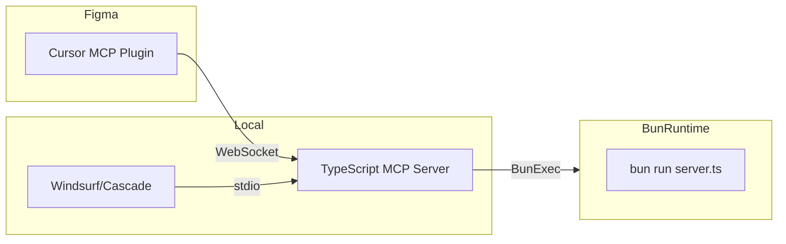

# Research: Existing Figma Tools & Integrations for AI Agent Interaction (via MCP)

Date: 2025-05-07

This document summarizes research into existing Figma tools, plugins, and third-party integrations that could enable AI agents (like Cascade or Claude Desktop) to programmatically interact with Figma designs or data, with a focus on solutions that might facilitate creating or leveraging an MCP (Model Context Protocol) service.

## Key Findings:

The research indicates that the Figma ecosystem provides several avenues for AI integration, including direct MCP implementations and various API-driven tools that could be adapted.

### 1. Direct MCP Implementations for Figma:

These are the most direct solutions for enabling AI agent interaction via MCP.

*   **Cursor AI's MCP Plugin for Figma:**
    *   **Reference:** Perplexity Search Result [5] (YouTube video: LvyHbMIqLVo)
    *   **Description:** Cursor AI has developed and showcased an MCP plugin that allows their AI to programmatically read, modify, and generate UI components directly within Figma. This system reportedly uses a websocket server for communication, enabling real-time, AI-driven design manipulation.
    *   **Relevance:** This is a highly relevant, existing example of an MCP-based tool for Figma, demonstrating the feasibility of the concept.

*   **Community Figma-MCP Server Implementations:**
    *   **References:** Perplexity Search Results [9], [10], [13]
    *   **Description:** The research highlighted the existence of community-driven Figma-MCP server implementations. Specific examples mentioned include:
        *   `mcp.so/server/figma-mcp-server/karthiks3000` (Source [10])
        *   `glama.ai/mcp/servers/@sichang824/mcp-figma` (Source [13])
        *   Apidog blog post discussing Figma MCP (Source [9])
    *   **Relevance:** These indicate active development and sharing of MCP server concepts tailored for Figma. They could serve as ready-to-use solutions or strong foundational codebases for custom MCP services.

### 2. API-Driven Plugins & Integrations (Potential for MCP Adaptation):

While not explicitly MCP-native, these tools demonstrate deep integration with Figma, likely through its APIs, and could potentially be interfaced with via an MCP service acting as a bridge.

*   **Lilt Figma Connector:**
    *   **Reference:** Perplexity Search Result [11]
    *   **Description:** Connects Figma to Lilt's AI-powered localization platform, suggesting capabilities for content extraction from designs and updating them programmatically.

*   **Voiceflow Integration:**
    *   **Reference:** Perplexity Search Result [14]
    *   **Description:** Allows designers to import Figma designs into Voiceflow to build conversational AI experiences. This implies programmatic access to Figma design data.

*   **Jasper.ai Partnership & Integration:**
    *   **Reference:** Perplexity Search Result [8]
    *   **Description:** Focuses on AI-generated content (text, images) directly within Figma, indicating programmatic content insertion capabilities.

*   **Other Advanced AI Plugins:**
    *   **References:** Perplexity Search Results [1], [4], [7], [12]
    *   **Examples:** Weavely.ai (screenshot to editable layers, form generation), FigVision (predictive heatmaps), Builder.io (code generation).
    *   **Description:** Many plugins offer specialized AI-driven functionalities. While their primary interface might be UI-based within Figma, their backend operations or accessibility through Figma's plugin API could be exposed or wrapped by an MCP service.

### 3. Figma's Native AI Capabilities:

*   **References:** Perplexity Search Results [2], [15]
*   **Description:** Figma is actively developing and integrating its own AI tools, such as "First Draft" for design generation from prompts and AI-assisted interaction creation. While these are currently more user-facing, the underlying infrastructure and future API developments for these native AI features could become accessible for MCP services.

## Conclusion & Implications for MCP Tools:

The research strongly supports the feasibility of using or creating MCP tools for Figma:

*   **Direct Solutions:** The Cursor AI plugin and community Figma-MCP server examples offer immediate starting points or usable implementations.
*   **Adaptable Ecosystem:** Figma's robust API and plugin architecture, demonstrated by numerous third-party integrations, provide a solid foundation for an MCP service to programmatically access and manipulate design data and functionalities.
*   **Growing Trend:** The presence of native AI features in Figma and multiple AI-powered plugins indicates a trend towards more programmatic and AI-driven design workflows, which aligns well with the goals of an MCP-based interaction model.

## Plan: Integrating Cursor's Figma MCP Plugin with Windsurf (Cascade)

Based on official and authoritative sources ([Cursor's GitHub](https://github.com/callmeartan/Figma-Cursor-MCP), [mcp.so](https://mcp.so/server/figma-mcp-server/karthiks3000), and Perplexity research), here is a step-by-step plan to enable Windsurf/Cascade to interact with Figma using Cursor's MCP plugin:

### 1. Prerequisites
- **Figma Account** (with Editor/Owner permissions)
- **Cursor MCP Plugin** (from Cursor or community repo)
- **Node.js** or **Bun** (as required by the MCP server)
- **API Token**: Figma Personal Access Token (with read/write scopes)
- **Windsurf (Cascade) instance**

### 2. Setup Cursor's MCP Plugin/Server
- Clone or download the Cursor Figma MCP server repo ([example](https://github.com/callmeartan/Figma-Cursor-MCP)).
- Install dependencies (`bun install` or `npm install`).
- Configure environment variables:
    - `FIGMA_TOKEN`: Your Figma API token
    - `PORT`: (default 3333) or as needed
    - `ALLOWED_ORIGINS`: (for CORS, if remote access needed)
- Start the MCP server: `bun run start` or `npm start`.
- Ensure the server is running and accessible (e.g., `ws://localhost:3333`).

### 3. Configure Figma Plugin/Integration
- Install the Cursor MCP plugin in Figma (if required for UI interaction).
- Authorize the plugin with your Figma API token.
- Open the target Figma file/project.
- (Optional) Enable plugin-specific features (e.g., auto-layout, code sync).

### 4. Connect Windsurf (Cascade) to MCP Server
- In Windsurf, add a new MCP server/tool:
    - Specify the MCP server endpoint (e.g., `ws://localhost:3333`)
    - Provide authentication details if required
    - Map available MCP actions to Windsurf agent commands (if customization needed)
- Test the connection by issuing a simple query (e.g., list Figma frames or components).

### 5. Usage & Automation
- Use Cascade's agentic interface to:
    - Query Figma design data (frames, layers, components)
    - Propose or apply design changes
    - Automate design-to-code or code-to-design workflows
    - Trigger custom MCP actions as supported by the server

### 6. Security & Best Practices
- Store Figma tokens securely; rotate every 90 days
- Use HTTPS for remote MCP server deployments
- Limit access to trusted agents/systems
- Monitor logs for unauthorized access or errors

### 7. Troubleshooting
| Symptom                  | Diagnostic Check                | Resolution                   |
|--------------------------|---------------------------------|------------------------------|
| Connection timeout       | `nc -zv localhost 3333`         | Verify MCP server running    |
| Authentication failures  | Token scopes in Figma Dev Portal| Regenerate with read/write   |
| Component misalignment   | Auto-layout constraints         | Reconfigure Figma frames     |
| Style drifts             | Cascade Memory version checks   | Re-sync design system        |

### 8. References & Further Reading
- [Cursor Figma MCP GitHub](https://github.com/callmeartan/Figma-Cursor-MCP)
- [mcp.so Figma MCP Server](https://mcp.so/server/figma-mcp-server/karthiks3000)
- [Builder.io blog: Figma to Windsurf](https://www.builder.io/blog/figma-to-windsurf)
- [Figma API Docs](https://www.figma.com/developers/api)

---
*Citations refer to the Perplexity search executed on 2025-05-07 around 23:36 ET, with query: "How do I set up and use Cursor's Figma MCP plugin to allow an external AI agent (like Windsurf/Cascade) to interact with Figma? Please provide official or authoritative steps and requirements."*


## Figma Account Requirements for MCP/AI Integration

- **Figma’s REST API and plugin ecosystem** (used by Cursor’s MCP plugin and similar tools) are available to all Figma users, including those on the free tier.
- **Personal Access Tokens** for the API can be generated with a free account.
- **Plugins** can be installed and used on the free plan.

**Limitations of the Free Tier:**
- File/project access is limited to files you own or are invited to edit.
- Collaboration and version history have some limits on the free plan.
- Some advanced features (design systems, shared libraries, branching, etc.) require a paid plan, but these are not required for basic MCP/API/plugin use.

**Cursor’s MCP plugin and most MCP tools do NOT require a paid Figma account for basic usage.**

You only need a paid account for advanced Figma features, not for agentic/MCP workflows or plugin/API access.

---

*Work paused here. Ready to resume setup or research at your request.*


## Next Setup Steps: Figma-Cursor-MCP Server

### 1. Install Bun (Windows)
Open PowerShell and run:
```powershell
irm https://bun.sh/install.ps1 | iex
```
After installation, restart your terminal or ensure Bun is in your PATH.

### 2. Install Project Dependencies
In the project directory:
```powershell
bun setup
```

### 3. Start the MCP Server
In the project directory:
```powershell
bun start
```

### 4. Windsurf MCP Config Example
Add to your `mcp_config.json` (adjust port/path as needed):
```json
"figma-cursor-mcp": {
  "command": "bun",
  "args": [
    "start"
  ],
  "cwd": "C:/Users/eddy/MCP/figma-cursor-mcp",
  "env": {
    "FIGMA_TOKEN": "your-figma-personal-access-token-here"
  }
}
```

### 5. Tips
- Your `.env` file should contain your `FIGMA_TOKEN`.
- Default server port is 3333. Change with `PORT` in `.env` if needed.
- After starting, the MCP server should be accessible at `ws://localhost:3333` (or your chosen port).
- Use Windsurf/Cascade to test connectivity and issue MCP commands.

---
*Setup steps documented on 2025-05-08. Ready to proceed with Bun install and server start when you are!*

---

## 🏗️ Project Architecture



```text
cursor-talk-to-figma-mcp/
├── src/
│   ├── talk_to_figma_mcp/    # TypeScript MCP server
│   ├── cursor_mcp_plugin/    # Figma plugin
│   └── socket.ts             # WebSocket communication
```

## 🚀 Next Steps: MacBook Setup and GitHub Fork

### Plan for Setting Up Figma-Cursor-MCP on M1 MacBook

1. **Clone the Project to MacBook**
   - Copy or clone the current codebase to your M1 MacBook (either via direct file transfer or by pushing to a new repo).

2. **Install Bun on macOS**
   - Open Terminal and run:
     ```bash
     curl -fsSL https://bun.sh/install | bash
     ```
   - Ensure `bun` is in your PATH after installation.

3. **Install Dependencies**
   - In the project directory:
     ```bash
     bun setup
     ```

4. **Update Environment Variables**
   - Ensure `.env` contains your `FIGMA_TOKEN` and any other required variables.

5. **Start the MCP Server**
   - In the project directory:
     ```bash
     bun run src/talk_to_figma_mcp/server.ts
     ```
   - Or, if you have a `start` script in `package.json`:
     ```bash
     bun start
     ```

6. **Update MCP Config**
   - Use the same MCP config as before, but verify paths are valid on macOS (case-sensitive, forward slashes).

7. **Test with Windsurf/Cascade**
   - Ensure the server starts and is accessible at the expected port.

---

### Plan to Fork and Sync to a New GitHub Repo (Unconnected to Original)

1. **Create a New GitHub Repository**
   - On GitHub, create a new private or public repository (do NOT fork from the original to avoid connection).

2. **Initialize Git in Project Directory (if not already)**
   ```bash
   git init
   git remote add origin https://github.com/YOUR_USERNAME/YOUR_NEW_REPO.git
   ```

3. **Add All Files and Commit**
   ```bash
   git add .
   git commit -m "Initial commit: Figma-Cursor-MCP migrated from Windows setup"
   ```

4. **Push to New GitHub Repo**
   ```bash
   git branch -M main
   git push -u origin main
   ```

5. **(Optional) Remove Old Remote/History**
   - Ensure no `.git` history or remotes from the original repo remain if you want a fully clean start.

---

*This plan will ensure a clean, platform-agnostic setup and a fresh GitHub repository, unconnected to the original project history.*